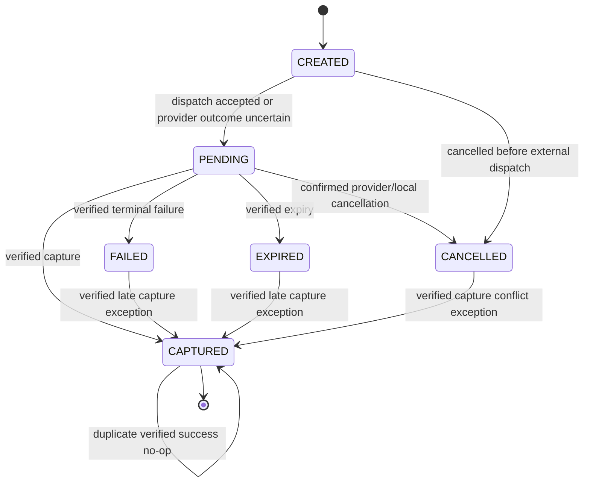
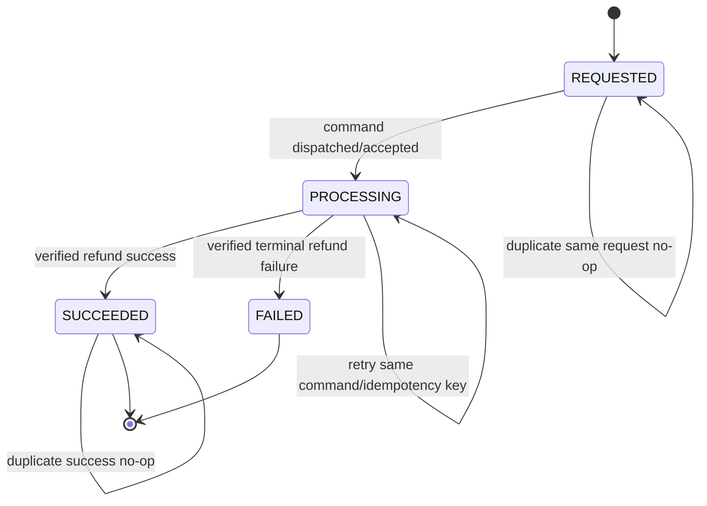

# Task 5A-03 — Payment/Refund State-machine Freeze

- Status: **FROZEN FOR SANDBOX/SHADOW DESIGN**
- Task verdict: **READY FOR 5A-04** (design only)
- Date: 2026-07-23
- Provider: Xendit Test Mode
- Currency: IDR
- Related ADR: `docs/task_5a-02_xendit_fund_flow_accounting_adr.md`
- Runtime guard: `PLATFORM_MONETIZATION_ENABLED=false`

## Scope and authority

This document freezes state transitions and event authority before payment or
refund implementation. It does not create a migration, adapter, webhook
endpoint, provider call, journal, payout, settlement, or owner payable.

The state machine is valid for the internal Test Mode demo and shadow facts.
LIVE collection remains blocked by the ADR approval deferral. Exact webhook
signature bytes, algorithm selection, timestamp tolerance, replay controls,
secret rotation, and redaction are frozen in Task 5A-04.

There are three separate concepts:

1. **Payment attempt state** — the canonical local state of one provider
   collection attempt.
2. **Payment/refund facts** — immutable provider references and terminal facts.
3. **Booking fulfillment state** — a downstream projection that must not be
   inferred from a browser redirect or from a refund approval.

`bookings.payment_reference` is not a provider payment ID. A provider payment
ID, provider event ID, and local payment-attempt ID remain separate identifiers.

## Frozen payment states

The canonical payment-attempt states are:

| State | Meaning | Terminal? |
|---|---|---:|
| `CREATED` | Local attempt and immutable amount/snapshot reference exist; external outcome is not yet known. | No |
| `PENDING` | Provider command was dispatched or an outcome is uncertain; includes network timeout and awaiting asynchronous channel result. | No |
| `CAPTURED` | Verified provider webhook or authenticated server inquiry proves the customer amount was captured. | Yes |
| `FAILED` | Provider or a validated local terminal error proves collection did not succeed. | Yes, except a verified late capture creates an exception |
| `EXPIRED` | Provider or local expiry rule proves the payment request can no longer be paid. | Yes, except a verified late capture creates an exception |
| `CANCELLED` | The attempt was cancelled before an external capture, or provider cancellation was confirmed. | Yes, except a verified late capture creates an exception |

`PENDING` is the only state for an unresolved timeout. The system must not
invent a `FAILED` result merely because the customer browser or provider call
timed out. Operational dashboards may label an unresolved pending attempt as
`UNCERTAIN`, but that label is not a new payment state or proof of failure.

## Payment transition graph

The arrows from `FAILED`, `EXPIRED`, or `CANCELLED` to `CAPTURED` are not normal
retries. They represent a provider-confirmed late capture and must create a
reconciliation exception, hold/refund handling, and audit record. They never
reopen an expired/cancelled booking or silently mark fulfillment complete.

Denied payment transitions:

- `CAPTURED -> PENDING`, `FAILED`, `EXPIRED`, or `CANCELLED`;
- `FAILED/EXPIRED/CANCELLED -> PENDING` as a new external payment attempt;
- any transition based only on a success/failure/cancel browser return;
- any capture with mismatched booking, currency, amount, provider account, or
  immutable fee snapshot;
- a second capture fact for the same booking;
- a retry that creates a new provider payment when the previous outcome is
  uncertain.

## Payment event authority

| Event/source | May advance payment state? | Rule |
|---|---:|---|
| Customer browser success URL | No | UX/navigation only; never payment authority. |
| Customer browser cancel/failure URL | No | UX/navigation only; does not prove provider failure. |
| Verified provider payment webhook | Yes | Verify before parsing/processing; deduplicate by provider event ID; validate amount, currency, booking reference, and provider payment ID. |
| Authenticated provider status inquiry | Yes | Server-to-server response may resolve `PENDING` when it is authenticated, consistent, and tied to the same payment request. |
| Local request timeout | No | Keep `PENDING`; enqueue/retry inquiry with the same idempotency boundary. |
| Webhook delivery timeout | No | Inbox remains durable; provider retry or operator replay must be safe. |
| Provider dashboard screenshot/manual claim | No | Evidence may support an investigation but cannot mutate payment state. |
| Local booking expiry/cancellation | No capture downgrade | It may prevent fulfillment and trigger exception handling, but cannot erase a provider capture. |

Only a verified `CAPTURED` fact may be used by a later normalized service to
produce a sandbox payment projection. In Phase 5, this remains a virtual fact;
it must not call the legacy owner-cash income path or create production finance
journals.

## Booking projection rules

- Payment state and booking fulfillment state remain separate.
- A verified capture may be displayed as a simulated paid result only behind
  the sandbox/shadow capability and banner.
- A browser return never sets booking `PAID`.
- A future LIVE capture-to-booking transition must validate the immutable fee
  snapshot and run atomically with the normalized payment fact.
- A verified late capture after local booking expiry/cancellation records the
  payment capture and exception, holds the amount for idempotent refund review,
  and does not reopen the slot or mark the booking fulfilled.
- Historical/manual-direct bookings do not create PSP clearing, owner payable,
  or platform commission facts.
- Booking `COMPLETED` is a service/fulfillment event. It is not a payment
  capture event and cannot be manufactured from a payment callback.

## Frozen refund states

The canonical Phase 5 refund states are:

| State | Meaning | Terminal? |
|---|---|---:|
| `REQUESTED` | An eligible full-refund request exists locally; provider dispatch has not been confirmed. | No |
| `PROCESSING` | The refund command was sent or provider accepted it for asynchronous processing. | No |
| `SUCCEEDED` | Provider webhook or authenticated inquiry confirms the refund request succeeded. | Yes |
| `FAILED` | Provider confirms the refund request failed, or an allowed terminal failure is recorded. | Yes |

Phase 5 supports one full refund only. The refund amount must equal the
captured customer amount. Partial refund is denied and is not a hidden future
state.

Refund approval is a business authorization only. It does not mean that money
has returned to the customer. Only provider-confirmed `SUCCEEDED` may create a
final refund fact or a reversal template in the isolated test ledger.

Denied refund transitions:

- refund without a verified captured payment;
- refund amount different from captured customer amount;
- partial refund or a second successful full refund;
- `SUCCEEDED -> PROCESSING`, `SUCCEEDED -> FAILED`, or any edit/delete of a
  successful refund fact;
- final reversal based only on owner/admin approval or customer browser state;
- ordinary refund path for a completed/payout/chargeback case that belongs in
  the exceptional dispute/negative-balance flow of a later phase.

## Payment/refund races

The following outcomes are frozen:

| Race | Required result |
|---|---|
| Capture and refund request arrive together | Lock the payment attempt first; only a captured payment may create `REQUESTED`; exactly one full-refund request is allowed. |
| Refund approval before capture | Keep approval/workflow separate; do not dispatch a money refund until capture eligibility is proven. |
| Capture arrives while refund is `PROCESSING` | Resolve both under the payment lock; do not claim refund success without the provider refund fact. |
| Refund succeeds before booking completion | Reverse owner entitlement and unearned commission exactly in an isolated template; no revenue is recognized. |
| Refund succeeds after completion but before payout | Use exceptional reversal/contra path; do not edit the completion journal. |
| Refund/chargeback after payout | Use owner receivable/negative-balance dispute flow; do not rewrite the old payout. |
| Local expiry/cancellation then provider capture | Keep the verified capture fact, mark late-capture exception, hold/refund idempotently, and never reopen the slot automatically. |
| Provider timeout while refund is being created | Keep `REQUESTED/PROCESSING`; inquiry/retry the same refund request, never create a second provider refund. |

## Timeout and retry rules

### Create-payment timeout

1. Create the local attempt and outbox command with a stable idempotency key.
2. If the provider response is absent, set/keep `PENDING`; do not mark
   `FAILED`.
3. Retry the same provider command only with the same idempotency key and
   equivalent request hash.
4. Use status inquiry to resolve the original provider payment request. Do not
   create a second external payment while the first is unresolved.
5. If the maximum retry/inquiry window is reached, escalate as unresolved and
   hold the booking/payment for review. `UNRESOLVED` is an operational incident
   label, not a new payment state.

### Webhook timeout or duplicate

- Persist a redacted inbox event before business processing.
- A duplicate `(provider, provider_event_id)` is a successful no-op.
- A webhook delivery retry must not create a second capture/refund fact.
- A same provider event ID with a different payload hash is a security/
  reconciliation exception and is rejected/quarantined.

### Inquiry timeout

- Keep the payment/refund in its current non-terminal state.
- Retry inquiry with the same inquiry idempotency boundary.
- Never infer failure from an inquiry timeout.

## Idempotency namespaces

The following stable namespaces are frozen for the later technical contract.
The exact serialized request hash and provider-key encoding belong to Task
5A-05, but the business boundaries may not change silently.

| Operation | Namespace/key boundary | Same key, same payload | Same key, different payload |
|---|---|---|---|
| Create payment | `payment:create:{booking_id}:{attempt_no}` | Return/replay the original local attempt and provider command. | Reject as idempotency conflict. |
| Provider inquiry | `payment:inquiry:{payment_attempt_id}` | Replay latest inquiry result; no new payment. | Reject/quarantine. |
| Capture recognition | `payment:capture:{provider}:{provider_payment_id}` | No-op after the first fact. | Reject/quarantine amount/reference conflict. |
| Payment webhook inbox | `webhook:{provider}:{provider_event_id}` | Return successful duplicate no-op. | Reject/quarantine hash conflict. |
| Full refund | `refund:create:{payment_attempt_id}:full:v1` | Return/replay the same refund fact/command. | Reject; a second full refund is not allowed. |
| Refund webhook inbox | `refund-webhook:{provider}:{provider_event_id}` | Successful duplicate no-op. | Reject/quarantine hash conflict. |
| Booking payment projection | `booking:payment-capture:{payment_attempt_id}` | No-op/replay projection result. | Reject; never create a second booking payment event. |

Idempotency must be enforced at the local database boundary and carried to the
provider command. It must not be generated randomly on retry.

## Lock order and transaction boundary

All state-changing handlers/services must follow one deterministic lock order:

1. Verify signature/authentication and parse only the minimum envelope outside
   the business transaction.
2. Insert/deduplicate the webhook inbox event using its unique provider event
   key.
3. Lock the canonical `payment_attempt` row (`FOR UPDATE`).
4. Lock the related `booking` row (`FOR UPDATE`) when fulfillment or booking
   eligibility is involved.
5. Lock the related `payment_refund` row (`FOR UPDATE`) when refund state is
   involved.
6. Validate immutable `booking_fee_snapshot` and amount/currency/reference
   facts using a consistent read; never update the snapshot.
7. Write the payment/refund fact, booking projection, outbox result, and audit
   in one transaction. Any isolated test-ledger template must be in the same
   transaction as its test capability guard.

No path may lock a refund before its payment attempt, or a booking before a
payment attempt, when both are participating in the same transition. Provider
network calls must not execute while these database locks are held. The
transactional outbox owns dispatch/retry after commit.

## Invariants

- One booking has at most one immutable captured payment fact.
- One payment attempt has at most one provider payment ID and one capture fact.
- One captured customer amount equals the immutable snapshot customer amount.
- `CAPTURED` is never downgraded.
- A late capture is never silently converted to a normal booking payment.
- Duplicate/out-of-order events cannot duplicate or lower a final fact.
- Browser callbacks cannot mutate payment or booking authority.
- Refund success never exceeds captured amount; Phase 5 successful refund is
  exactly the captured amount.
- Refund approval is not refund success.
- Provider timeout never proves failure.
- Payment status, refund status, booking status, settlement, and payout remain
  separate state machines.
- No gateway state transition writes legacy owner cashbook income.
- No Phase 5 runtime state transition creates production actual journal,
  payable, settlement, payout, or revenue.
- Every accepted mutation has a stable idempotency key and an audit reference;
  immutable facts are corrected only through explicit reversal/exception facts.

## Transition acceptance matrix

| Scenario | Expected state/result | Must be denied |
|---|---|---|
| Normal provider success webhook | `PENDING -> CAPTURED`; one capture fact | Browser-only success or amount mismatch |
| Provider failure webhook | `PENDING -> FAILED` | Retry as a new payment with a new key while original is unresolved |
| Provider expiry webhook | `PENDING -> EXPIRED` | Mark `CAPTURED` from expiry/redirect alone |
| Customer network loss after submit | `PENDING`; inquiry/webhook resolution | Immediate `FAILED` or duplicate payment creation |
| Provider timeout after possible debit | `PENDING`; same-key inquiry/retry | Blind retry with a new external payment |
| Duplicate success webhook | No-op | Second capture, second booking payment, second journal |
| Out-of-order failure after capture | Keep `CAPTURED`; audit/no-op | Downgrade to `FAILED` |
| Late capture after expiry/cancellation | Capture fact + exception/hold/refund workflow | Reopen booking or mark fulfillment complete automatically |
| Approved full refund | `REQUESTED` only | Claim customer has been refunded |
| Refund dispatch accepted | `REQUESTED -> PROCESSING` | Create another refund command |
| Refund success webhook | `PROCESSING -> SUCCEEDED`; exact full amount | Partial/second refund or source-journal edit |
| Refund failure webhook | `PROCESSING -> FAILED`; preserve evidence | Claim success or silently reverse booking |
| Duplicate/out-of-order refund webhook | No-op or keep final state | Duplicate reversal or downgrade `SUCCEEDED` |

## Required test/fixture cases for the next implementation phases

The later implementation must prove these cases on a disposable database and
with redacted provider fixtures:

- create retry after timeout with one local attempt and one provider key;
- capture webhook before and after inquiry, both idempotent;
- duplicate capture, duplicate refund, and duplicate provider event;
- out-of-order pending/failure/expiry after capture;
- late capture after local expiry/cancellation;
- amount, currency, booking, provider, and snapshot mismatch;
- concurrent capture requests and concurrent capture/refund requests;
- refund approval without provider success;
- refund timeout/retry with same key;
- full refund before completion and exceptional refund after completion;
- no partial refund and no second successful full refund;
- webhook inbox restart/replay and conflicting payload hash;
- rollback of the complete local transaction without orphan fact/outbox/audit;
- proof that no path calls legacy owner-cash income or writes production journal.

## Handoff and boundary

Task 5A-04 must now freeze the security and operational details around this
state machine: exact signature bytes/algorithm, constant-time verification,
timestamp tolerance, replay defense, rate limits, secret storage/rotation,
redaction, audit schema, and incident handling.

This state machine is approved for drafting and review under the internal
Test Mode demo decision. It is not approval for LIVE collection, owner payout,
xenPlatform, production funds, or actual finance posting.

**READY FOR 5A-04 — SANDBOX/SHADOW DESIGN ONLY**
